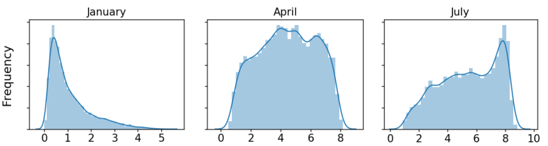

# Submodule: GSEE - Climate Data Interface

The climate data interface is included as a submodule to the GSEE. It allows the processing of gridded climate data with the GSEE. Climate data with annual, seasonal, monthly, daily and hourly temporal resolution is supported. The motivation behind this submodule was to simplify the use of the GSEE with large sets of gridded data and to provide methods to process data with lower resolution than hourly data, since this is a rare good. The module also allows the use of characteristic probability densitiy functions (PDFs) describing the distribution of irradiance on the days of each month. These PDFs allow for a much more accurate calculation of monthly, seasonal and annual PV due to the non-linear character of the PV-model.

#### Required libraries:
Additionally to the requirements of the gsee:

+ [joblib](https://pypi.org/project/joblib/)
+ [SciPy](https://www.scipy.org/)
+ [Xarray](http://xarray.pydata.org/en/stable/)
+ [Cython](http://cython.org/)

#### Requirements for input files:
The provided data files must be in the the ```netCDF``` format and contain at least the three dimensions with the names 'lat', 'lon', 'time' and a data-variable. At least one file with mean total irradiance data (by default in W/m2) must be provided. Up to this moment only dates with up to the years 2500 can be processed (due to limitations of pandas). Working on a fix... Some climate data files also use a 360-days calendar with 12x30 days. These files do not work as pandas does not like days like 30. February.

## What does it do?
**Very short**: The interface reads climate data from the provided files and processes it with the GSEE in different manners depending on the temporal resolution and chosen options.

**Much longer**:

#### The main function an its parameters
The main function has the following parameters: (imported with ```import gsee.climdata_interface.interface```)

```python
def run_interface(ghi_tuple: tuple, outfile: str, params: dict, diffuse_tuple=('', ''),       
                  temp_tuple=('', ''), timeformat='other', use_pdfs=True,
                  pdfs_file_path='', num_cores=multiprocessing.cpu_count()):
```

**Required Parameters:**

* __`ghi_tuple`__: Tuple containing the filepath and the name of the data-variable for the mean total horizontal solar iradiance. E.g. `('/home/user/data/th_solar_.nc', 'rsds')`
* __`outfile`__: File path and name for the output file. E.g. */home/username/GSEE/output-file.nc*
* __`params`__: Dictionary, containing entries for each parameter used by the GSEE: `'tilt', 'azimuth', 'tracking', 'capacity'`. Additionally `'data_freq'` is also stored in this dict. Temporal resolution of the input data. Accepts the following strings: `['A', 'S', 'M', 'D', 'H']`, which stand for *annual, seasonal, monthly, daily, hourly* data. Also `'detect'` can be stored in `'data_freq'` then the script will try to guess the frequency from the input data. Instead of a number you can also pass a function depending on latitute for `tilt`, see Example.

**Optional Paramters:**

* __`diffuse_tuple`__: Tuple containing the filepath and the name of the data-variable for the diffuse fraction. Only usefull when horizontal irradianceis provided in hourly resolution. With higher temporal resolutions, the diffuse fraction is estimated anyways with the BRL-model (`from gsee import brl_model`)
* __`temp_tuple`__: Tuple containing the filepath and the name of the data-variable for the ambient temperature. Can be in °C or °K. If no ambient temperature is provided, GSEE will assume 20°C by default.
* __`timeformat`__: Some CMIP5 datasets have time saved in the format: *day as %Y%m%d.%f* (e.g. '20070104.5'). Xarray cannot parse this dataformat. If that is the case, `'cmip5'` can be passed and the dates will be correctly interpreted.
* __`use_PDFs`__: Boolean. Toggle option whether to use the characteristic probability density functions or not.
* __`num_cores`__: By default all CPU-cores are used. However this can be limited here. If `1` is passed, then no parallelization will be used.
* __``pdfs_file_path``__: Path to the file in which the PDFs are stored.

#### Passing a dataset directly
Instead of letting the script read and prepare the data, a xarray dataset can also be passed directly to the following function (e.g. when using the module in combination with a larger application):
```python
def run_interface_from_dataset(ds_in: xr.Dataset, params: dict, use_pdfs=True,
                                pdfs_file_path='', num_cores=multiprocessing.cpu_count())
                                 -> xr.Dataset:
```
* __`ds`__: xarray dataset containing at lest one variable 'global_horizontal' with mean global horizontal irradiance in W/m2. Optional variables: 'diffuse_fraction', 'temperature' in °C.

#### Pre-Processing the climate data for the gsee
Depending on the temporal resolution of the input data and chosen options, the interface applies different methods to ready the data for the GSEE.

##### __`use_PDFs=True`__:
This is enabled by default, as it generally produces better results. It triggers the use characteristic probability density functions (PDFs) that describe the probability with which a day with a certain amount of radiation occurs within a month. The PDFs are available on a worldwide grid of 2°x2° for each month.
Example PDFs:

Each PDF consists of 128 bins, each assigned a value for an amount of daily radiation and the probability of that radiation occuring.
The PDFs are then used to upsample Annual, seasonal, and monthly data to daily data. This daily data gets upsampled to hourly values using a sinusoidal diurnal cycle model, taking the sum of daily radiation as well as sunrise and sunset into account. Now the data is ready to be passed to the gsee.

##### __`use_PDFs=False`__:

In this case the mean value given by the data is regarded as one representative day for the whole season or month. In case of annual data, two days, one in spring and one in autum, are calculated. These days are again upsampled to hourly values using the sinusoidal diurnal cycle.

##### Diffuse fraction:
The diffuse fraction is calculated using the BRL-model (Ridley, 2010) with the use of the atmospheric clearness index (k<sub>t</sub>). The clearness index is extimated using the method from Elminir (2007).

#### Output
The climatdata-interface outputs the data in the same resolution as the input data was in. The unit of the output data is **Wh/day**. Except for hourly values it is **W/hour**.

#### Example:

The following scripts should serve as an example of parameters with which the interface can be used.

```python
import gsee.climatedata_interface.interface as inter

basefolder = '/home/username/climate_data'

th_file = '{}/sis-split-years2011-monmean.nc'.format(basefolder)
df_file = '{}/df-split-years2011-monmean.nc'.format(basefolder)
at_file = '{}/tas-split-years2011-monmean.nc'.format(basefolder)

var_names = ['SIS', 'df', 'T2M']

outfile = '{}/outputs.nc4'.format(basefolder)

timeformat = 'other'

# A function of tilt depending on lat can be provided, or simply a fixed value returned:
def tilt_function(lat):
    return 0.35396 * lat + 16.84775

params = {'tilt': tilt_function, 'azimuth': 180, 'tracking': 0, 'capacity': 1, 'data_freq': 'detect'}
use_pdfs = True
pdfs_file_path='/home/username/PDFs/MERRA2_rad3x3_2011-2015-PDFs_land_prox.nc4'

inter.run_interface(ghi_tuple=(th_file, var_names[0]), diffuse_tuple=(df_file, var_names[1]),
                    temp_tuple=(at_file, var_names[2]), outfile=outfile, params=params,
                    timeformat=timeformat, use_pdfs=use_pdfs, pdfs_file_path=pdfs_file_path)
```

#### Optaining monthly probability density functions (PDFs)

When installed with the pip command one dataset of monthly PDFs will be included in the package. These PDFs are based on NASAs MERRA-2 'SWGDN' (surface incoming shortwave flux) field from 2011-2016, remapped to a 3°x3° grid and filtered for grid-cells in proximity of land masses. With `gsee.climdata_interface.create_pdfs_from_ds` additional datasets with other base data and higher resolution can be processed to create a custom set of PDFs.
```Python
def create_pdfs_from_ds(ds, outfile, only_land=True, proximity=True, lat_bounds=(-60, 75)):
  """
Creates new file contaning the probabiliy densitiy functions for each month of how often a specific amount of
radation can occur. This is done for every grid-cell from the incoming dataset.

Parameters
----------
ds: xarray dataset
    with 'time', 'lat', 'lon' dimensions and data-variable 'SWGDN'
outfile: string
    path and filename where the resulting file should be stored.
    Must end with .nc4
only_land: bool
    If true: only gridcells whose center is on land will be computed.
    False: all cells are computed
proximity: bool
    If true: A cell is also computed if one of the surrounding cells is land. This makes shure that all coastal
    regions are included, as sometimes the middle of a gridcell can be on the ocean, but still a great part is
    on land. Without this option, all these cases would not be included.
lat_bounds: Tuple
    containing boundaries for the latitude to be included in the resulting datset. All latitudes between the two
    values of the tuple will be inlcuded.
"""

```
##### References

* Elminir, H. K., Y. A. Azzam, and F. I. Younes, 2007: Prediction of hourly and daily diffuse fraction using neural network, as compared to linear regression models. Energy, 32, 1513–1523, [doi:10.1016/j.energy.2006.10.010](http://dx.doi.org/10.1016/j.energy.2006.10.010)
* Ridley, B., J. Boland, and P. Lauret, 2010: Modelling of diffuse solar fraction with multiple predictors. Renew. Energy, 35, 478–483, [doi:10.1016/j.renene.2009.07.018](http://dx.doi.org/10.1016/j.renene.2009.07.018)
