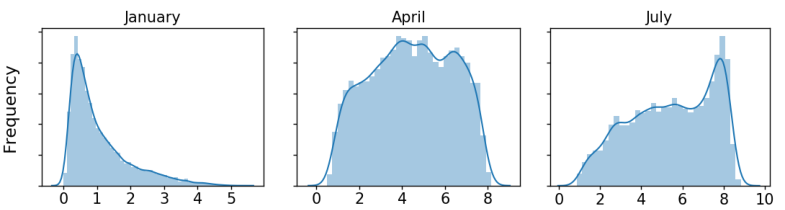

# Climate data interface

The climate data interface (`gsee.climate`) allows the processing of gridded climate data with GSEE. Climate data with annual, seasonal, monthly, daily and hourly temporal resolution are supported. The interface turns the input into hourly simulations of PV electricity generation and aggregates the results back to the input resolution.

The motivation behind this module is to simplify the use of GSEE with large sets of gridded data and to provide methods to process data with lower-than-hourly resolution. The module also allows the use of characteristic probability density functions (PDFs) describing the distribution of irradiance across the days of each month. These PDFs allow for a much more accurate calculation of monthly, seasonal and annual PV output due to the non-linear character of the PV model.

## Input data requirements

`run_climate` takes an `xarray.Dataset` with either grid dimensions `(time, lat, lon)` or a flat site list `(time, site)` with `lat(site)`/`lon(site)` coordinates, containing:

- **`global_horizontal`** (required): mean total horizontal irradiance, in W/m2.
- **`temperature`** (optional): ambient temperature in degrees Celsius. 20 °C is assumed if absent.
- **`diffuse_fraction`** (optional, hourly data only): with lower-than-hourly resolution the diffuse fraction is always estimated with the [BRL model](diffuse-fraction.md).

Open NetCDF files with `xarray` and rename variables as needed:

```python
import xarray as xr

data = xr.open_dataset("rsds_monthly.nc").rename({"rsds": "global_horizontal"})
```

Known limitations:

- Climate data using non-standard calendars (e.g. a 360-day calendar with 12x30 days) do not work, as timestamps like 30 February cannot be represented.
- Some CMIP5/CMIP6 datasets store time as numbers in the format _day as %Y%m%d.%f_ (e.g. `20070104.5`), which `xarray` cannot parse. Pass `timeformat='cmip5'` and the dates will be correctly interpreted.

## Usage

```python
import gsee.climate

result = gsee.climate.run_climate(
    data,                # xarray.Dataset as described above
    tilt=35,             # Degrees, may also be a function of latitude
    azim=180,            # Degrees, 180 = towards equator
    tracking=0,          # 0 = fixed, 1 = 1-axis, 2 = 2-axis
    capacity=1000,       # W
    frequency="detect",  # Or one of 'A', 'S', 'M', 'D', 'H'
    pdfs="builtin",      # See below. Requires `pip install gsee[climate]`
)
result["pv"]  # Over the input time dimension(s)
```

- **`frequency`**: temporal resolution of the input data. In addition to the default, `'detect'`, accepts `'A'`, `'S'`, `'M'`, `'D'`, `'H'`, which stand for _annual, seasonal, monthly, daily, hourly_ data.
- **`tilt`** can be given as a latitude-dependent function instead of a static value, e.g. `tilt=lambda lat: 0.35396 * lat + 16.84775` or `tilt=gsee.pv.optimal_tilt`.
- **`seed`**: makes the PDF-based day sampling reproducible.
- Options of [`run_sites`](running/multi-site.md) such as `workers`, `dtype`, `technology` or `system_loss` can be passed through directly.

Output units follow v0.3 conventions: `pv` is in Wh (per hour) for hourly input, and Wh/day for all coarser input resolutions.

## Dealing with less-than-hourly-resolution data

Depending on the temporal resolution of the input data and chosen options, the interface applies different methods to create synthetic hourly irradiance to feed into the PV model.

### Sinusoidal diurnal cycle

Daily irradiance totals are distributed over the hours of the day with a sinusoidal profile between sunrise and sunset (`gsee.core.synthesis.diurnal_profile`), normalized so that each day's mean irradiance exactly matches the input.

### Representative days

Without PDFs (`pdfs=None`), the mean value given by the data is regarded as one representative day for the whole month or season (the mid-month day is simulated). In the case of annual data, two days, one in spring and one in autumn, are simulated and averaged. Daily data is simulated day by day.

### Probability density functions (PDFs)

Passing `pdfs` enables the use of characteristic probability density functions that describe the probability with which a day with a certain amount of radiation occurs within a month. This generally produces better results for annual, seasonal and monthly data than representative days, because the PV model responds non-linearly to irradiance.

Example PDFs:



Each PDF consists of 128 bins, each assigned a value for an amount of daily radiation and the probability of that radiation occurring. For each month covered by an input timestep, every day is drawn from the PDF of the nearest available grid cell, and the drawn days are scaled so that the input timestep's mean irradiance is preserved.

The built-in set of PDFs is based on the NASA MERRA-2 reanalysis `SWGDN` (surface incoming shortwave flux) field from 2011-2015, remapped to a 3°x3° grid and filtered for grid cells in proximity of land masses. It is contained in the optional `gsee-climate-data` companion package:

```bash
pip install gsee[climate]
```

and used with `pdfs="builtin"`. Unlike in v0.3, no data is downloaded at runtime.

Custom PDFs can be passed instead of `"builtin"`, either as a file path or an `xarray.Dataset`, with `month`, `lat` and `lon` dimensions plus one bin dimension, and variables `xk` (bin values) and `pk` (bin probabilities).

The v0.3 script for generating PDFs from a reanalysis dataset can be found on the [0.3 branch](https://github.com/renewables-ninja/gsee/tree/0.3) (`climatedata_interface/generate_pdfs.py`).

## Diffuse irradiance fraction

For all synthesized hourly data, the diffuse fraction is estimated with the [BRL model](diffuse-fraction.md).
